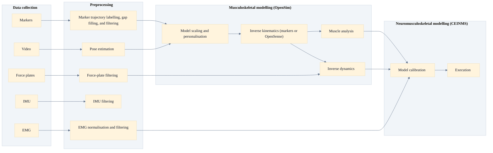

# Data Processing and NMSK Modelling Guidelines

Details for the below topics can be found by clicking on the link or in the corresponding directory. It is strongly suggested to follow a [standard folder structure](./fundamentals/suggested_folder_structure.md).

## [1. Data collection and synchronisation](1_data_collection.md)
* [Markers](1_data_collection/markers.md)
    * [Markerset Guide](1_data_collection/markerset_guide.md)
* [EMG](1_data_collection/emg.md)
    * [HD-EMG](1_data_collection/hd_emg.md)
* [Force plates](1_data_collection/force_plates.md)
* [IMU](1_data_collection/imu.md)
* [Markerless](1_data_collection/markerless.md)
* [Sampling frequencies](1_data_collection/sampling_frequencies.md)
* [Synchronisation](1_data_collection/synchronisation.md)

## [2. Preprocessing](2_preprocessing/README.md)
* [Marker trajectory processing and gap filling](2_preprocessing/marker_trajectory_processing_and_gap_filling.md)
* [Filtering choices and rationales for kinematics and kinetics](2_preprocessing/filtering_choices_and_rationales_for_kinematics_and_kinetics.md)
* [Coordinate systems and conventions](2_preprocessing/coordinate_systems_and_conventions.md)
* [Force-plate processing](2_preprocessing/force_plate_processing.md)
* [EMG preprocessing](2_preprocessing/emg_preprocessing.md)
    * [Muscle synergies](2_preprocessing/muscle_synergies.md)

## [3. Musculoskeletal modelling](3_msk_modelling/README.md)
* [Model scaling and personalisation](3_msk_modelling/model_scaling_and_personalisation.md)
* [Inverse kinematics](3_msk_modelling/inverse_kinematics.md)
* [Muscle analysis](3_msk_modelling/muscle_analysis.md)
* [Inverse dynamics](3_msk_modelling/inverse_dynamics.md)
* [Joint reaction analysis](3_msk_modelling/joint_reaction_analysis.md)

## [4. Neuromusculoskeletal modelling](4_nmsk_modelling/README.md)
* [CEINMS](4_nmsk_modelling/CEINMS/README.md)
    * [CEINMS-NN](4_nmsk_modelling/CEINMS/ceinms_nn.md)
    * [CEINMS-WEB](4_nmsk_modelling/CEINMS/ceinms_web.md)
    * [CEINMS-RT](4_nmsk_modelling/CEINMS/ceinms_rt.md)
* [Model initialisation and tuning](4_nmsk_modelling/model_initialisation_and_tuning.md)
* [Model calibration](4_nmsk_modelling/model_calibration.md)
* [Execution](4_nmsk_modelling/execution.md)
    * [EMG-driven](4_nmsk_modelling/execution_emg_driven.md)
    * [EMG-hybrid/assisted](4_nmsk_modelling/execution_emg_hybrid.md)
    * [Static optimisation](4_nmsk_modelling/execution_static_optimisation.md)

## [Fundamentals](fundamentals/README.md)
* [Conventions](fundamentals/conventions.md)
* [File Types](fundamentals/file_types.md)
* [Software Tools](fundamentals/software_tools.md)
* [Standard Folder Structure](./fundamentals/suggested_folder_structure.md)

----
